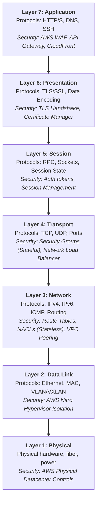

# Days 02–03 — Subnetting, CIDR Math & the OSI Model

## 1. Executive Summary & Core Mechanics

### Subnetting & CIDR Mechanics
An IPv4 address is a 32-bit integer formatted into four 8-bit octets separated by dots (e.g., `192.168.1.50`). Conceptually, every IP address consists of two parts:
1. **Network Portion (Prefix):** Identifies the specific network or subnetwork.
2. **Host Portion:** Identifies the unique machine/interface on that network.

The **Subnet Mask** (or **CIDR** notation `/N`) dictates the boundary between network bits and host bits. In `192.168.1.0/24`, the `/24` signifies that the first 24 bits are fixed for the network, leaving $32 - 24 = 8$ bits for host assignment ($2^8 = 256$ total addresses, with 254 usable in standard networking).

#### Why Subnetting Exists Mechanically:
* **Local vs. Routed Decisions:** When a host sends a packet, it bitwise-ANDs the destination IP with its own subnet mask. If the resulting network prefix matches its own, it sends the packet locally via Layer 2 (ARP resolution to MAC). If it does not match, the packet is forwarded to the **Default Gateway** (router). Subnetting allows hosts to make this decision autonomously without consulting a central routing engine.
* **Blast Radius & Network Segmentation:** Flattening an entire environment into a single large subnet allows any compromised machine to directly inspect broadcast traffic, initiate arbitrary Layer 2/3 reconnaissance, and pivot laterally. Subnetting enforces topological boundaries controlled by routers, firewalls, and route tables.

---

## 2. The 7-Layer OSI Model in Cloud Security

The **Open Systems Interconnection (OSI)** model partitions network interactions into seven abstraction layers. In modern cloud architecture, knowing the exact layer dictates what a security tool can inspect and control.

### Layer-by-Layer Architecture & Security Controls

```text
+-----------------------------------------------------------------------------------------+
| Layer 7: Application   | HTTP, HTTPS, DNS, SSH, SMTP      | AWS WAF, API Gateway, App Mesh |
+-----------------------------------------------------------------------------------------+
| Layer 6: Presentation  | TLS, SSL, JSON, ASCII, JPEG      | TLS Termination, ACM Certificates|
+-----------------------------------------------------------------------------------------+
| Layer 5: Session       | Sockets, RPC, NetBIOS, Sessions  | Session Tokens, IAM Auth Tokens |
+-----------------------------------------------------------------------------------------+
| Layer 4: Transport     | TCP, UDP, Ports (443, 22, 53)    | Security Groups, NLB, TCP Reset |
+-----------------------------------------------------------------------------------------+
| Layer 3: Network       | IPv4, IPv6, ICMP, IP Routing     | VPC Route Tables, NACLs, Routers|
+-----------------------------------------------------------------------------------------+
| Layer 2: Data Link     | Ethernet, MAC Addressing, VLAN   | AWS VPC Virtual Fabric / Nitro  |
+-----------------------------------------------------------------------------------------+
| Layer 1: Physical      | Bits, Fiber, Radio Waves, Cables | AWS Datacenter Physical Security |
+-----------------------------------------------------------------------------------------+
```



### Critical Security Distinction: Layer 4 vs. Layer 7 Controls
* **Layer 4 Controls (AWS Security Groups, Network Load Balancers):** Inspect only IP headers and TCP/UDP headers (`Source IP:Port` $\to$ `Dest IP:Port`). They have **zero visibility** into encrypted payloads or HTTP request semantics.
* **Layer 7 Controls (AWS WAF, Application Load Balancers):** Terminate or inspect the HTTP stream, parse request headers, query strings, cookies, and POST bodies. They detect and block application attacks (e.g., SQL Injection, Cross-Site Scripting, Log4j strings) that pass invisibly through Layer 4 firewalls.

---

## 3. Hands-on Lab: CIDR Math & Paper Calculations

### The Exercise:
Split **`192.168.10.0/24`** into **4 equal subnets**.

#### Step 1: Bits to Borrow
* To produce 4 subnets, we need $2^n \ge 4 \implies n = 2$ bits.
* New CIDR Prefix: $24 + 2 = \mathbf{/26}$.
* Host bits remaining: $32 - 26 = 6$ bits.
* Total IP addresses per subnet: $2^6 = 64$.
* Standard usable hosts per subnet: $64 - 2 = \mathbf{62}$ hosts.

#### Step 2: Subnet Allocation Table

| Subnet # | CIDR Block | Network IP | Usable Host Range | Broadcast IP | Standard Usable | AWS Usable |
| :---: | :---: | :---: | :---: | :---: | :---: | :---: |
| **1** | `192.168.10.0/26` | `192.168.10.0` | `192.168.10.1` – `192.168.10.62` | `192.168.10.63` | 62 | 59 |
| **2** | `192.168.10.64/26` | `192.168.10.64` | `192.168.10.65` – `192.168.10.126` | `192.168.10.127` | 62 | 59 |
| **3** | `192.168.10.128/26` | `192.168.10.128` | `192.168.10.129` – `192.168.10.190` | `192.168.10.191` | 62 | 59 |
| **4** | `192.168.10.192/26` | `192.168.10.192` | `192.168.10.193` – `192.168.10.254` | `192.168.10.255` | 62 | 59 |

> **AWS Production Gotcha:** Standard networking reserves 2 addresses per subnet (`.0` network and `.255` broadcast). **AWS reserves 5 addresses** in every subnet:
> 1. `x.x.x.0`: Network address.
> 2. `x.x.x.1`: Reserved by AWS for the VPC router.
> 3. `x.x.x.2`: Reserved by AWS for DNS (AmazonProvidedDNS).
> 4. `x.x.x.3`: Reserved by AWS for future use.
> 5. `x.x.x.255`: Network broadcast address (AWS does not support broadcast, but reserves the address).
> *In AWS, a `/26` provides $64 - 5 = \mathbf{59}$ usable IP addresses.*

### Script Verification:
Run the lab automation script located at [labs/day02-03/subnet_calc.py](file:///d:/CLOUD%20SECURITY/labs/day02-03/subnet_calc.py):
```bash
python labs/day02-03/subnet_calc.py
```

---

## 4. Break It Safely: Subnetting Architecture Diagnosis

### The Problematic Architecture:
> *"I have a VPC with CIDR `10.0.0.0/24`. I want to create two subnets: Subnet A as `10.0.0.0/23` and Subnet B as `10.0.128.0/24`."*

### Architectural Diagnosis:
This design is fundamentally invalid and will be rejected by any cloud provider (AWS, Azure, GCP) or network hypervisor for two distinct reasons:

1. **Subnet A (`10.0.0.0/23`) is larger than its parent VPC:**
   * The VPC CIDR is `/24`, which contains $2^{(32-24)} = 256$ IP addresses (`10.0.0.0` to `10.0.0.255`).
   * Subnet A is defined as `/23`, which requires $2^{(32-23)} = 512$ IP addresses (`10.0.0.0` to `10.0.1.255`).
   * **Rule:** A subnet's prefix length must be **greater than or equal to** the VPC's prefix length. A subnet cannot contain more addresses than the VPC that hosts it.

2. **Subnet B (`10.0.128.0/24`) is outside the VPC address space:**
   * The VPC CIDR `10.0.0.0/24` covers only addresses where the third octet is `0` (`10.0.0.0` – `10.0.0.255`).
   * Subnet B uses `10.0.128.0/24`, where the third octet is `128`. This is completely disjoint from the VPC's allocated CIDR block.
   * **Rule:** All subnet IP ranges must be strict subsets residing entirely inside the parent VPC CIDR boundary.

### The Engineering Fix:

#### Option 1: Carve within the existing `/24` VPC (128 addresses each)
If the VPC must remain `10.0.0.0/24`:
* **Subnet A (Public Tier):** `10.0.0.0/25` (Range: `10.0.0.0` – `10.0.0.127`, 123 usable in AWS)
* **Subnet B (Private Tier):** `10.0.0.128/25` (Range: `10.0.0.128` – `10.0.0.255`, 123 usable in AWS)

#### Option 2: Expand the VPC to accommodate large enterprise tiers
If Subnet A truly requires 512 addresses (`/23`) and Subnet B requires 256 addresses (`/24`), resize the VPC:
* **VPC CIDR:** `10.0.0.0/16` (Standard AWS recommendation: 65,536 addresses)
* **Subnet A:** `10.0.0.0/23` (`10.0.0.0` – `10.0.1.255`)
* **Subnet B:** `10.0.2.0/24` (`10.0.2.0` – `10.0.2.255`)

---

## 5. Security Perspective & Cloud Architecture Connection

```text
                    VPC CIDR (10.0.0.0/16)
                             |
         +-------------------+-------------------+
         |                                       |
Public Subnet (10.0.1.0/24)             Private Subnet (10.0.2.0/24)
Route: 0.0.0.0/0 -> Internet Gateway    Route: 0.0.0.0/0 -> NAT Gateway
         |                                       |
    [Public ALB]                            [App / DB Tier]
(Inspects Layer 7 WAF)                 (Protected from Inbound Net)
         |                                       |
         +-----------> [Security Group] <--------+
                    (Filters Layer 4 Port)
```

1. **Defense-in-Depth vs. "Security Group Only" Fallacy:**
   * A common anti-pattern is placing databases, application workloads, and web servers into a single flat public subnet, relying entirely on Security Groups to block internet traffic.
   * If an engineer accidentally misconfigures a Security Group rule (`0.0.0.0/0:5432`), an internet-routable database is instantly exposed. With subnet segmentation, even if the database Security Group is wide open, packets from the internet **cannot physically be routed** to the private subnet because its route table lacks an Internet Gateway route.
2. **Blast Radius Containment:**
   * Placing backend services in isolated subnets prevents a compromised public-facing web server from using raw Layer 2 broadcast or unrestricted direct Layer 3 probing against sensitive data stores.

---

## 6. Interview Questions & Model Answers

### Beginner:
1. **What does the `/24` in a CIDR block actually mean?**  
   *Answer:* It denotes that the first 24 bits (from left to right) represent the fixed network portion of the address, leaving the remaining 8 bits ($32 - 24$) for host addresses ($2^8 = 256$ total addresses).

2. **Why are the first and last address in a subnet unusable for standard hosts?**  
   *Answer:* The first address (all host bits 0) is reserved as the Network Identifier, used by routing tables. The last address (all host bits 1) is reserved as the Directed Broadcast address for transmitting frames to all nodes on that subnet.

3. **Name the 7 OSI layers in order, bottom to top.**  
   *Answer:* Layer 1: Physical, Layer 2: Data Link, Layer 3: Network, Layer 4: Transport, Layer 5: Session, Layer 6: Presentation, Layer 7: Application.

### Intermediate:
4. **What is the difference between a Layer 4 and a Layer 7 load balancer in terms of visibility?**  
   *Answer:* A Layer 4 load balancer (like AWS NLB) routes based solely on IP addresses and TCP/UDP ports; it cannot decrypt or inspect application content. A Layer 7 load balancer (like AWS ALB) terminates the connection, decrypts TLS, and inspects HTTP headers, cookies, URLs, and payloads, allowing routing by path (e.g., `/api` vs `/static`) and inspection by WAF rules.

5. **Why does segmenting a network into subnets improve security beyond simple "organization"?**  
   *Answer:* It implements architectural defense-in-depth and reduces blast radius. By binding subnets to distinct route tables (e.g., public vs. private), internet egress and ingress can be physically severed. Even if an instance-level firewall (Security Group) is misconfigured, unrouted subnets remain unreachable from unauthorized networks.

6. **How many usable hosts does a `/27` subnet have?**  
   *Answer:* A `/27` leaves $32 - 27 = 5$ host bits ($2^5 = 32$ total addresses). In standard networking, $32 - 2 = \mathbf{30}$ usable hosts. In an AWS VPC, because AWS reserves 5 addresses per subnet, it has $32 - 5 = \mathbf{27}$ usable hosts.

### Scenario-Based:
7. **You inherit a VPC where the database subnet has a route to an Internet Gateway. What is the risk, and what is the fix?**  
   *Answer:* The risk is that database instances assigned public IPs (or exposed via elastic IPs) are directly routable from the public internet, making them vulnerable to brute-force and zero-day network attacks. The fix is to dissociate the database subnet from the public route table and attach it to a private route table that has no route to an `igw-xxxx` (routing outbound traffic only to a NAT Gateway or VPC Endpoint if updates are required).

8. **An engineer proposes putting all servers (web, app, DB) into a single `/24` subnet with Security Groups as the only control. What is your pushback?**  
   *Answer:* This violates the principle of defense-in-depth. Security Groups are software-defined rules subject to human error and permission sprawl. In a flat subnet, a single misconfigured rule or compromised IAM credential immediately exposes backend databases to direct internet ingress and lateral network traversal. Multi-tier subnetting enforces routing-level isolation that security groups alone cannot guarantee.

### Difficult:
9. **Explain why TLS is sometimes described as operating at "Layer 4.5" or spanning Session/Presentation layers, and why that ambiguity doesn't matter in practice.**  
   *Answer:* The OSI model was developed in the 1970s–1980s before modern protocol stacks like TLS existed. TLS runs on top of TCP (Transport / Layer 4) and performs encryption/formatting (Presentation / Layer 6) while establishing secure stateful sessions (Session / Layer 5). Because modern internet protocols use the 4-layer TCP/IP model, security engineers treat TLS simply as an encrypted transport tunnel operating right beneath the application layer (Layer 7). What matters is whether a security control is placed before TLS decryption (blind to payload) or after TLS termination (full payload inspection).

---

## 7. Mini Assessment Self-Check
- [x] **Usable hosts in a `/28` subnet:** $32 - 28 = 4$ host bits $\implies 2^4 = 16$ addresses. Standard usable: $16 - 2 = \mathbf{14}$ hosts (AWS usable: $16 - 5 = \mathbf{11}$ hosts).
- [x] **Layer of a switch & forwarding mechanism:** Operates at **Layer 2 (Data Link)**; forwards frames using hardware **MAC addresses** stored in a CAM table.
- [x] **Layer of a router & forwarding mechanism:** Operates at **Layer 3 (Network)**; forwards packets using logical **IP addresses** stored in a routing table.
- [x] **Why `10.0.0.0/23` and `10.0.128.0/24` cannot exist in a `10.0.0.0/24` VPC:** A `/23` is twice as large as a `/24` (512 IPs vs 256 IPs), violating containment. Furthermore, `10.0.128.0` is an entirely different network block outside the `10.0.0.0/24` range.
- [x] **WAF blocking SQL injection layer:** Operates at **Layer 7 (Application)**. A Security Group operates at **Layer 4 (Transport)** and only evaluates IP headers and port numbers; it cannot inspect HTTP request strings or SQL tokens inside packet payloads.
