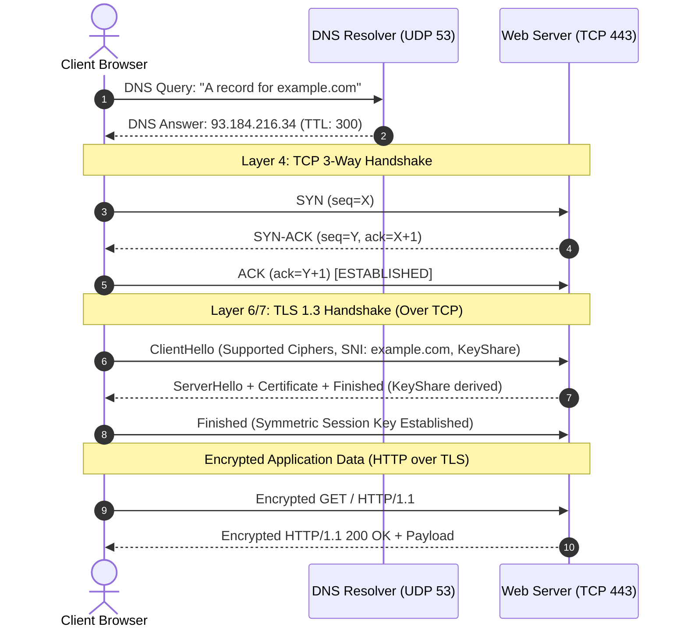

# Days 04–05 — Ports, Protocols, HTTP/HTTPS, SSH, DNS & TLS

## 1. Executive Summary & Core Mechanics

Once an IP packet successfully reaches a destination host via Layer 3 routing, the operating system must determine which running application or daemon should receive it. This demultiplexing occurs at **Layer 4 (Transport)** using **Ports**.

### 1. Ports Demystified
* A port is an unsigned 16-bit integer ($0$ to $65,535$).
* **Well-Known Ports ($0$–$1023$):** Assigned by IANA for standard system daemons (HTTP `80`, HTTPS `443`, SSH `22`, DNS `53`). Binding to these ports on Unix/Linux requires root (`CAP_NET_BIND_SERVICE`) privileges.
* **Registered Ports ($1024$–$49151$):** Used by software vendors and applications (e.g., MySQL `3306`, PostgreSQL `5432`, Redis `6379`).
* **Dynamic / Ephemeral Ports ($49152$–$65535$):** Allocated temporarily by the client OS as the source port for outbound sessions so incoming reply packets can be uniquely mapped back to the originating socket.
* **Socket Definition:** An exact communication endpoint defined as `IP Address : Port Number` (e.g., `192.168.1.50:51234` $\leftrightarrow$ `93.184.216.34:443`).

---

### 2. DNS (Domain Name System) — Port 53
DNS is a decentralized, hierarchical naming service mapping human-readable hostnames to IP addresses.
* **The Lookup Hierarchy:**
  1. **Stub Resolver (OS):** Checks local cache and `hosts` file.
  2. **Recursive Resolver (ISP / 8.8.8.8):** Queries on behalf of the client.
  3. **Root Servers (`.`):** Directs the resolver to the Top-Level Domain (TLD) servers.
  4. **TLD Servers (`.com`, `.org`):** Directs to the Authoritative Name Server.
  5. **Authoritative Name Server:** Holds the definitive DNS zone records (`A`, `AAAA`, `CNAME`, `MX`, `TXT`) and returns the IP.
* **Transport Choice:** Primarily operates over **UDP 53** because queries and responses are lightweight and connectionless, minimizing latency. It falls back to **TCP 53** for responses exceeding 512 bytes (EDNS0 allows up to 4096 over UDP) and for DNS Zone Transfers (`AXFR`).

---

### 3. HTTP vs. HTTPS & TLS Architecture
* **Plaintext HTTP (Port 80):** Operates entirely in the clear. Request methods (`GET`, `POST`), target paths (`/login`), request headers (`Cookie: session_id=...`), and request bodies (`password=secret`) can be intercepted and tampered with by any intermediary on the path.
* **HTTPS (Port 443):** HTTP running inside an encrypted **TLS (Transport Layer Security)** tunnel.

#### The Three Security Guarantees of TLS:
1. **Confidentiality:** Symmetric encryption (e.g., AES-GCM, ChaCha20-Poly1305) ensures only the communicating parties can read the data.
2. **Integrity:** Message Authentication Codes (HMAC) or Authenticated Encryption (AEAD) prevent silent alteration or truncation of packets in transit.
3. **Authentication:** Digital certificates issued by trusted Certificate Authorities (CAs) bind the server's public key to its domain name, preventing impersonation.

#### Asymmetric vs. Symmetric Cryptography in TLS:
* **Asymmetric Encryption (RSA, ECDHE):** Computationally expensive. Used exclusively during the initial TLS handshake to verify the server's identity and securely negotiate a shared secret.
* **Symmetric Encryption (AES-256):** Highly efficient. Uses the derived shared session key to encrypt all subsequent application HTTP payloads.

---

### 4. SSH (Secure Shell) — Port 22
* Encrypted remote terminal administration.
* **Why Key-Based Authentication Beats Passwords:**
  * Passwords can be brute-forced, sprayed, or sniffed if an administrator makes an error.
  * In Public Key Authentication (`ssh-rsa`, `ed25519`), the private key never leaves the client machine. The server issues a cryptographic random challenge, and the client signs it with its private key. The server verifies the signature using the client's public key stored in `~/.ssh/authorized_keys`. The private key is never exposed across the wire.

---

## 2. Technical Walkthrough: End-to-End Packet Lifecycle

When an engineer accesses `https://example.com`:



---

## 3. Hands-on Lab: Practical Verification

### Lab 1: DNS Resolution & TTL Analysis
Querying DNS A-records for `example.com`:

```bash
# Using dig (Linux/macOS) or Resolve-DnsName (PowerShell):
Resolve-DnsName example.com
```

#### Actual Output:
```text
Name         Type   TTL   Section    IPAddress
----         ----   ---   -------    ---------
example.com  A      14    Answer     104.20.23.154
example.com  A      14    Answer     172.66.147.243
example.com  AAAA   22    Answer     2606:4700:9ad5:72db:f2ef:c6b:ef6b:ff98
```
* **Analysis:** The `TTL` (Time To Live) is configured in seconds. Resolvers cache this mapping for the duration of the TTL. In dynamic cloud environments, low TTLs (60–300 seconds) are used for Route 53 health-check failover.

---

### Lab 2: TLS Certificate Inspection via OpenSSL
Extracting certificate metadata from `example.com:443`:

```bash
openssl s_client -connect example.com:443 -servername example.com </dev/null 2>/dev/null | openssl x509 -noout -issuer -subject -dates
```

#### Actual Output:
```text
issuer=C=US, O=SSL Corporation, CN=Cloudflare TLS Issuing ECC CA 3
subject=CN=example.com
notBefore=Jul 29 22:10:08 2026 GMT
notAfter=Oct 27 22:17:21 2026 GMT
```
* **Analysis:**
  * **Issuer:** The intermediate CA that cryptographically signed the certificate.
  * **Subject:** The common name (`CN`) matching the requested domain.
  * **Validity Dates:** Automated monitoring (e.g., AWS Certificate Manager / CloudWatch) alerts before `notAfter` to prevent certificate expiration outages.

---

### Lab 3: Deep Dive into Server Name Indication (SNI)

#### What is SNI and Why is it Essential?
* **The Problem:** In modern hosting and CloudFront / ALB setups, a single physical server and IP address host hundreds of different TLS-enabled domains (Virtual Hosting). When a client initiates a TLS connection to an IP, the server needs to present the correct certificate. However, in standard HTTP, the `Host: example.com` header is only sent *inside* the encrypted HTTP request—after the TLS handshake has already finished!
* **The Solution (SNI):** SNI (RFC 6066) is an extension to the TLS protocol where the client includes the desired domain name in plaintext inside the initial `ClientHello` packet. This enables the web server or Load Balancer to select and serve the appropriate certificate before encryption begins.
* **Security Insight:** Because SNI is sent in plaintext during the `ClientHello`, passive network eavesdroppers (ISPs, network firewalls) can observe which domain name a client is visiting, even though all subsequent HTTP URLs, paths, and content remain fully encrypted.

---

## 4. Break It Safely: Plaintext HTTP vs. HTTPS Inspection

### Comparing `http://neverssl.com` vs. `https://example.com`

```bash
curl.exe -I http://neverssl.com
curl.exe -I https://example.com
```

#### Observed Header Output:
```http
# Plain HTTP (neverssl.com)
HTTP/1.1 200 OK
Date: Fri, 25 Sep 2026 10:01:32 GMT
Server: Apache/2.4.68 ()
Content-Type: text/html; charset=UTF-8

# HTTPS (example.com)
HTTP/1.1 200 OK
Date: Fri, 25 Sep 2026 10:01:31 GMT
Server: cloudflare
Content-Type: text/html
```

### Threat Breakdown: What Can an On-Path Attacker Intercept?

| Traffic Element | Over Plaintext HTTP (`neverssl.com`) | Over HTTPS (`example.com`) |
| :--- | :--- | :--- |
| **Destination IP & Port** | Visible (`x.x.x.x:80`) | Visible (`x.x.x.x:443`) |
| **Target Domain** | Visible in `Host` header | Visible via SNI in `ClientHello` |
| **Exact URL Path** | **Visible in cleartext** (`GET /api/v1/user/reset-password`) | **Encrypted** (Hidden) |
| **Query Parameters** | **Visible in cleartext** (`?token=secret123`) | **Encrypted** (Hidden) |
| **HTTP Request Headers** | **Visible** (`User-Agent`, `Authorization`) | **Encrypted** (Hidden) |
| **Session Cookies** | **Visible** (`Cookie: auth_session=abcd`) | **Encrypted** (Hidden) |
| **POST Request Body** | **Visible** (`username=admin&password=Password1!`) | **Encrypted** (Hidden) |
| **Server Response Body** | **Visible in raw HTML/JSON** | **Encrypted** (Hidden) |
| **Tampering Capability** | Attacker can inject malicious JS/malware | Attacker cannot tamper (HMAC/AEAD integrity check) |

---

## 5. Fix It: Closing the Gap with HSTS & Preloading

### Why a `301 Moved Permanently` Redirect Is Not Enough
Many sites redirect HTTP to HTTPS:
```http
HTTP/1.1 301 Moved Permanently
Location: https://example.com/
```
**The Vulnerability (SSL Stripping):**
1. The user types `example.com` into their browser.
2. The browser initiates the very first connection over **plaintext HTTP** (`http://example.com:80`).
3. An attacker positioned on the local network (e.g., public Wi-Fi via ARP spoofing) intercepts that first HTTP packet.
4. Using an SSL-stripping tool (such as `sslstrip`), the attacker proxies the connection to the legitimate server over HTTPS, but strips the TLS layer when sending responses back to the victim over HTTP.
5. The victim never receives the 301 redirect, and their entire session remains in plaintext.

### The Remediation: HSTS (HTTP Strict Transport Security)
The server injects the `Strict-Transport-Security` response header:
```http
Strict-Transport-Security: max-age=63072000; includeSubDomains; preload
```
* **`max-age=63072000`:** Instructs the browser to strictly communicate over HTTPS for the next 2 years.
* **`includeSubDomains`:** Enforces HTTPS across all existing and future subdomains.
* **`preload`:** Authorizes inclusion in the browser vendor's global **HSTS Preload List** (maintained by Google and built into Chrome, Firefox, Safari, and Edge).
* **Security Result:** With preloading, the browser automatically rewrites `http://` to `https://` internally **before** opening a network socket. The vulnerable initial plaintext packet is never transmitted onto the wire.

---

## 6. Cloud & Threat Perspective

### 1. Port Scanning & Reconnaissance
* Attackers scan ports using SYN-scans (`nmap -sS`) to discover listening daemons, outdated software versions, and exposed management ports.
* **Deliverable 1 Connection:** On Day 10, we will build an automated port scanner to audit exposed ports across cloud instances.
* **AWS GuardDuty:** Triggers findings such as `Recon:EC2/Portscan` when an instance sends or receives anomalous connection probes across multiple ports.

### 2. DNS Abuse & Covert Data Exfiltration (DNS Tunneling)
* **The Technique:** Because perimeter firewalls and security groups almost always allow outbound UDP port 53 to allow name resolution, attackers abuse DNS as a covert data exfiltration channel.
* **Mechanics:** An attacker registers `malicious-domain.com` and operates its authoritative nameserver. Stolen data is split, encoded (base64/hex), and queried as subdomains:
  ```text
  QUERY: dXNlcm5hbWU9YWRtaW4=.malicious-domain.com -> Attacker DNS Server logs query and reconstructs stolen data
  ```
* **Detection:** Monitored via AWS Route 53 Resolver Query Logs and VPC Flow Logs. Security analysts look for high entropy in subdomains, unusually long query names (>100 characters), and abnormal query volume.

### 3. SSH Hardening & Bastions
* Exposing port 22 to `0.0.0.0/0` results in automated dictionary and brute-force attacks within minutes.
* **Cloud Best Practices:**
  1. Restrict Security Group ingress to trusted corporate CIDRs or VPN IP addresses.
  2. Enforce key-based authentication (`ed25519`); disable password authentication (`PasswordAuthentication no`).
  3. Replace exposed SSH entirely with **AWS Systems Manager (SSM) Session Manager**, which tunnels shell access over HTTPS (TLS 443) using IAM roles without opening inbound port 22.

---

## 7. Interview Questions & Model Answers

### Beginner:
1. **What is the difference between a port and an IP address?**  
   *Answer:* An IP address identifies a specific host/device on a network (Layer 3), while a port identifies a specific application, service, or process listening on that host (Layer 4).

2. **What port does HTTPS run on, and what port does SSH run on?**  
   *Answer:* HTTPS runs on TCP port **443**; SSH runs on TCP port **22**.

3. **What does DNS actually do in one sentence?**  
   *Answer:* DNS is a distributed hierarchical lookup system that translates human-readable domain names into machine-routable IP addresses.

### Intermediate:
4. **What three security properties does TLS provide?**  
   *Answer:* Confidentiality (encryption of data against eavesdropping), Integrity (prevention and detection of message tampering via cryptographic hashes), and Authentication (verifying server and optionally client identities via PKI/digital certificates).

5. **Why is SSH key-based authentication considered more secure than password authentication?**  
   *Answer:* Key-based authentication relies on asymmetric cryptography with 2048+ bit keys that are mathematically infeasible to brute-force. Furthermore, the private key never crosses the network; the client merely signs an ephemeral challenge issued by the server, eliminating credential interception and replay risks.

6. **What is SNI, and why is it needed?**  
   *Answer:* Server Name Indication (SNI) is a TLS extension where the client indicates the hostname it wants to connect to in the plaintext `ClientHello` packet. This enables a web server or load balancer hosting multiple TLS domains on a single IP address to return the correct digital certificate before encrypting the connection.

### Scenario-Based:
7. **A security scan flags a web server still supporting TLS 1.0. Why is that a finding, and what do you recommend?**  
   *Answer:* TLS 1.0 has deprecated cryptographic designs vulnerable to known cipher attacks (such as BEAST and POODLE) and lacks support for modern secure cipher suites. It also violates compliance standards like PCI-DSS. I recommend reconfiguring the web server or load balancer security policy to disable TLS 1.0 and 1.1, enforcing **TLS 1.2 and TLS 1.3** with secure ciphers (PFS enabled).

8. **You find an EC2 instance with port 22 open to `0.0.0.0/0` and password authentication enabled. Walk through remediation in priority order.**  
   *Answer:*
   1. **Immediate Ingress Lockdown:** Update the instance's Security Group to remove `0.0.0.0/0:22` ingress immediately, restricting it only to a bastion host or corporate VPN CIDR.
   2. **Disable Password Authentication:** Edit `/etc/ssh/sshd_config` to set `PasswordAuthentication no` and restart `sshd`.
   3. **Audit Authorized Keys:** Inspect `~/.ssh/authorized_keys` across all local user accounts for unauthorized keys.
   4. **Architectural Fix:** Migrate the instance to AWS Systems Manager (SSM) Session Manager, allowing administrative shell access over IAM authentication without exposing port 22.

### Difficult:
9. **Explain why DNS is an under-monitored channel for data exfiltration, and how it works technically.**  
   *Answer:* Perimeter firewalls routinely allow outbound UDP port 53 so internal servers can resolve hostnames. Attackers abuse this by encoding confidential data into subdomains queried against an attacker-controlled authoritative nameserver (e.g., `exfil-data.attacker.com`). Internal recursive resolvers forward the query through the internet to the attacker's nameserver, which logs the subdomain requests and decodes the payload. Because standard firewalls only inspect IP/port headers and ignore payload entropy, this covert channel bypasses traditional egress filtering unless DNS query logging and inspection (e.g., Route 53 Resolver DNS Firewall) are deployed.

---

## 8. Mini Assessment Self-Check
- [x] **SNI information & encryption status:** SNI reveals the target domain name (e.g., `example.com`); it is sent in **plaintext** inside the initial TLS `ClientHello` before encryption is established.
- [x] **Why DNS uses UDP over TCP:** UDP is connectionless and has minimal packet overhead, allowing fast, single-packet request-response lookups. It falls back to TCP when responses exceed maximum payload limits (EDNS0 > 4096 bytes) or for zone transfers.
- [x] **Difference between certificate proof vs. encryption alone:** Encryption scrambles the data so third parties cannot read it, but without a certificate, you could be securely encrypting your credentials to an attacker (MITM). A certificate proves **identity**—verifying that the public key belongs to the legitimate domain owner.
- [x] **301 redirect with Location header:** The web server instructs the client that the requested resource has moved permanently to the specified HTTPS URL, prompting the browser to issue a new request to port 443.
- [x] **SIEM alert on internal host making thousands of long DNS queries:** Suspect **DNS tunneling / data exfiltration** or C2 (command-and-control) beaconing. Next steps: isolate the affected host from the network, inspect the query logs for base64/hex payloads, identify the initiating process/PID, and block the destination domain at the DNS firewall.
